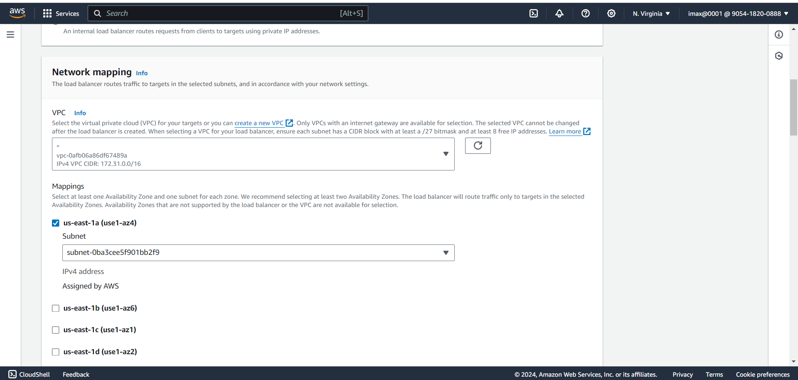

# Implementation of Classic Load Balancer with two EC2 Instances(Using Apache2 Web-server)

**1. Create two EC2 instances with same config**

**2. ssh 1st EC2 Instance and install Apache2 server**
- ssh -i "max123.pem" ubuntu2-34-229-106-17.compute-1-1.amazonaws.com
- `sudo -i`
- `apt-get update`
- `apt-get install apache2`

- For Checking Active status of server: `service nginx status`
- For Interact with server type: `curl localhost`
- Then go to default location of server type: `cd /var/www/html`
- For file check type: `ls`
- For Checking content of file type: `cat index.html`

- For print "Welcome Machine 1..!" on page type: `echo "Hello Machine 1..!">index.html`

**3. Go to chrome put 1st instance public ip, then we can see "Welcome Machine 1..!" on web page**

**4. Then follow same process for instance 2, After successfully done process then open public ip of 2nd instance on chrome we can see "Hello Machine 2...!" is display on web page**

**5. Then After go to Load Balancer page and click on 'Create Load Balancer'**

**6. Open Classic Load Balancer and then click on 'Create' for creating Classic Load Balancer**

**7. Enter meaningful Name for our Load Balancer**

**8. Then in Network mapping section select our instance Availability Zone**

**9. Default Security group, Listeners and routing and Health check**

**10. Then Instances section click on 'Add Instances' button to add our both instances.**

**11. default Attributes and Review the Summary and click on 'Create Load Balancer'**

**12. After successfully add load balancer then click on view load balancer**

**13. In Load Balancer page go to Security page and click on Security group Id**

**14. Click on 'Edit inbound rules' button**

**15. Then click on Add rule and select Type: HTTP and Source: Anywhere**

**16. After successfully add rule then review the details**

**17. Then go to Load Balancer page and copy DNS Name**

**18. Go to Browser and open DNS name and For checking refresh page then we can see changes like 'Hello Machine 1..!' to 'Hello Machine 2..!' then we can say load balancer working fine!**

